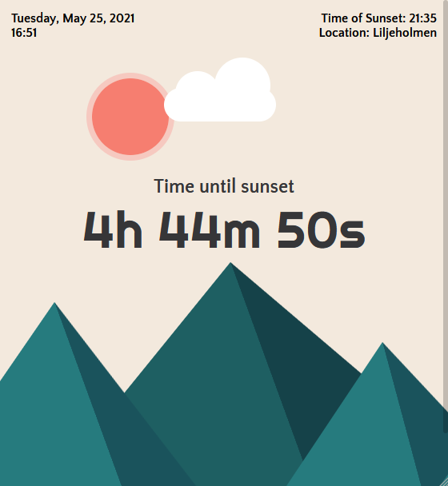

# finding-daylight
An app to help you track when its daylight where you are. Helpfull in Sweden so you dont miss to go out and get some D-vitamins! :)

This is how the app looks like

Its written in vanilla JS in autum 2020.

Check it out here: https://finding-daylight.firebaseapp.com/ :)

### Process

This project was made together with Emma Scott-Allen (https://github.com/emmy-codes), Sofia Darke(https://github.com/sofiadarkeweb) and Aleksandra Astaroth(https://github.com/aleksandraAstaroth).

We had a workaround for CORS issues so we could fetch the sunset and sunrise from an open api, but that workaround was deprecated so the app stopped working during the spring of 2020.
Since I really like this app, feel proud of it and really wanted to be able to show it to others, I wrote some backend code in Node.js so that the frontend would send a request to our server and then to the open api. This made the app work!
I found out that I could host this backend code in Firebase through firebase functions. So now the app is working an live and you can visit it here:
https://finding-daylight.firebaseapp.com/

#### !SPOILER ALERT!
~~Click on the sun to get some... advice I guess haha!~~
